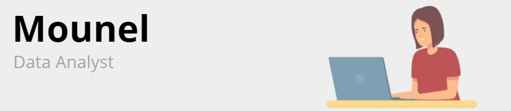

# Hi, I'm Mounel 👋 👩‍💻

### &nbsp; 🕵️‍♀️ A propos de moi 

Scientifique de formation, passionnée par la résolution de problèmes, j’ai décidé d’évoluer vers le rôle de Data Analyst.  Ma capacité à préparer, explorer et modéliser les données me permettra de fournir des recommandations précieuses pour la prise de décisions stratégiques au sein de votre entreprise.   

### &nbsp; 🌟 Mes compétences 
&nbsp;&nbsp;&nbsp;🔹 Capacité d'adaptation pour développer de nouvelles compétences. 
&nbsp;&nbsp;&nbsp;🔹 Appétence pour les études et la recherche. 
&nbsp;&nbsp;&nbsp;🔹 Maîtrise des outils d'analyse de données et des plateformes de visualisation . 
&nbsp;&nbsp;&nbsp;🔹 Pensée critique et résolution de problèmes. 
&nbsp;&nbsp;&nbsp;🔹Capacité à diriger et encadrer des équipes . 

### &nbsp; 🖥️ Main tech knowledge
<table>
<td>
  <ul>
    <li><b>Languages</b>: Python, SQL, DAX</li>
    <li><b>Framework</b>: Pandas, NumPy, Matplotlib, Seaborn, Scikit-learn, Scipy</li>
    <li><b>Database</b>: MySQL</li>
    <li><b>Tools</b>: Excel, Power BI, Tableau, Powerpoint</li>
    <li><b>Others</b>: Git, Jupyter Notebooks, Visual Studio Code, KNIME</li>
  </ul>
</td>
</table>
<table>
  <tr>
    <td></td>
    <td></td>
    <td></td>
 </tr>
</table>
  

                      

 

